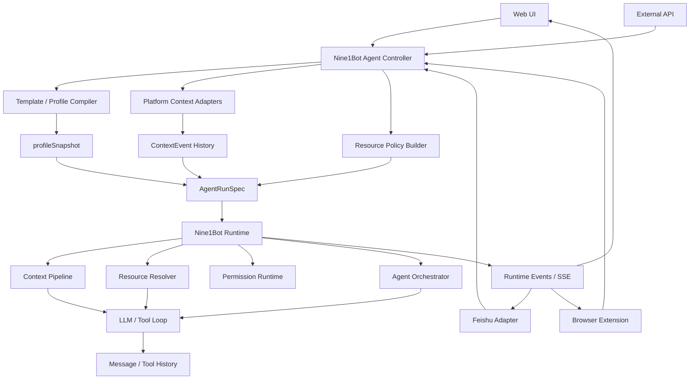

# Agent Runtime 与 Nine1Bot Controller 总体设计

## 1. 设计结论

Nine1Bot 下一阶段的核心变化不是继续给每个入口各自补 prompt、工具开关和平台逻辑，而是把 agent 能力拆成两层：

- 现有 `opencode/` 代码被重构并收编为 `Nine1Bot Runtime`，负责对话运行、上下文编译、工具资源解析、权限、事件、agent loop 和 multi-agent 执行能力。
- `Nine1Bot` 负责产品化 controller 和平台 adapter，负责用户配置、入口模板、场景信息采集、资源开关、UI 选择和平台兼容。

这意味着各入口不再直接拼接 prompt 或散落传入 tools / MCP / skills，而是由 Nine1Bot Controller 生成统一的 `AgentRunSpec`，再交给 Nine1Bot Runtime 编译、冻结和执行。

核心判断是：

- Nine1Bot Runtime 不应该硬编码 GitLab、Feishu、浏览器页面这些产品平台细节。
- Nine1Bot 不应该持续绕过 runtime 去修补 busy、权限、上下文、MCP 加载和 agent loop 的运行时缺陷。
- 用户配置要成为默认会话模板的一部分，而不是被新 controller 设计替代。
- 每次对话真正生效的上下文、agent、resources、权限，都应该能被解释、持久化、审计和复现。

## 2. 设计目标

这套设计要同时解决三个层面的问题。

### 2.1 统一内部 agent 接入

Web、Feishu、浏览器插件、GitLab 页面、API 调用等入口，都通过 Nine1Bot Controller 接入 agent 能力。入口只描述当前场景和用户输入，不直接承担 agent runtime 的内部拼装。

需要支持：

- 普通多轮对话。
- 浏览器页面态感知的对话。
- 平台深度适配，例如 GitLab repo / MR / issue。
- 条件允许时让用户显式选择 agent、模型和场景模板。
- 不同场景下的 single-agent 和 multi-agent 编排。

### 2.2 统一资源管理

tools、MCP、skills 和 permissions 都纳入资源 profile，不再让入口各自维护一套隐式开关。

第一阶段的资源合并策略保持保守：

- tools 可以按模板和场景增加。
- MCP / skills 只支持增量加入，不支持模板级排除或减少。
- MCP / skills / agent 只在会话开始时确定，不允许每轮切换。
- 资源声明和实际可用性分离，实际失败时通过 runtime event 通知客户端。

### 2.3 统一上下文构建

原来的 instructions / context 要尽早重构为 context block pipeline，而不是继续堆字符串。

上下文由多层 block 构成：

- 基础上下文：Nine1Bot Runtime 身份、通用行为原则。
- 项目上下文：项目目录、项目文件、项目说明、环境约束。
- 用户上下文：用户偏好、用户配置、长期记忆。
- 业务上下文：开启的业务能力，例如浏览器、GitLab、文档处理。
- 平台上下文：平台稳定信息，例如 GitLab host、repo path、用户身份。
- 页面上下文：请求发送时采集的当前页面信息，例如当前 MR、issue、选区。
- turn 上下文：本轮消息、附件、临时 override。
- loop 上下文：agent loop 内部工具结果、runtime 事件和短期状态。

Context pipeline 必须支持开关、排序、预算、审计、去重和压缩。

## 3. 分层边界

### 3.1 Nine1Bot Runtime 负责

Nine1Bot Runtime 应该承担 agent 运行机制本身：

- session 生命周期、busy reject、cancel、resume。
- `AgentRunSpec` 的 runtime 侧校验、编译和执行。
- context pipeline 的标准执行框架。
- tools / MCP / skills 的 resource resolver。
- 权限请求、单次授权、会话授权和硬性拒绝。
- LLM stream、tool call、tool result、permission ask、resource failure 等事件。
- agent loop 与 multi-agent orchestration 的底层执行。
- trace、audit、debug snapshot 和可观测性。

判断标准：只要问题属于“agent 运行时如何组织输入、能力和状态”，就优先考虑放入 Nine1Bot Runtime。

### 3.2 Nine1Bot Controller 负责

Nine1Bot 负责产品和平台语义：

- Web、Feishu、浏览器插件、GitLab 等入口体验。
- 用户配置、项目配置、默认模板、场景模板。
- agent 选择 UI、模型临时切换 UI、资源开关 UI。
- 平台 adapter，例如 GitLab repo / MR / issue 页面解释。
- 请求发送时的页面态采集和后端补全。
- 将平台信息编译成 runtime 可理解的 `AgentRunSpec`。
- 将 runtime event 转换成 Web SSE、Feishu 消息或插件提示。

判断标准：如果概念带有具体平台名、产品入口、UI 交互或用户配置语义，应优先放在 Nine1Bot Controller 或 adapter。

## 4. 核心对象

### 4.1 AgentRunSpec

`AgentRunSpec` 是 Nine1Bot Controller 和 Nine1Bot Runtime 之间的内部运行协议。它不是给终端用户编辑的配置文件，也不是某个入口的专用请求体。

它描述一次 agent 运行所需的完整输入：

- 协议版本和能力协商。
- session 与 entry 信息。
- 用户输入。
- 模型选择。
- agent 选择。
- context blocks。
- tools / MCP / skills / permissions。
- orchestration policy。
- runtime options。
- audit 和 debug 信息。

字段细节见 [AgentRunSpec 字段详细说明](./03-agent-run-spec-fields.md)。

### 4.2 SessionProfile 与 profileSnapshot

`SessionProfile` 是会话启动时编译出的稳定运行配置。创建会话时，Controller 会把用户配置、默认模板、入口模板、项目配置和用户选择合并成一份 `profileSnapshot`，并和会话记录一起持久化。

后续多轮对话继续使用这份 `profileSnapshot`：

- 用户修改全局配置只影响新会话。
- agent、MCP、skills、会话级 context、会话级权限基线都来自 snapshot。
- 会话中模型选择是例外，允许用户显式切换。
- 用户对权限请求选择“本 session 都允许”时，会把 grant 写入当前 `profileSnapshot.sessionPermissionGrants`。

这保证旧会话可复现，也避免配置变化在长对话中产生不可解释的漂移。

### 4.3 TurnRuntimeSnapshot

`TurnRuntimeSnapshot` 是每轮开始 agent loop 前冻结的运行时快照。

它来自：

- 当前会话的 `profileSnapshot`。
- 当前有效模型。
- 请求发送时采集或补全的 page context。
- 本轮用户输入和附件。
- 已确认的 context event history。
- 本轮 runtime override。

agent loop 内部不再重新感知配置、页面和资源变化，而是使用同一个 `TurnRuntimeSnapshot`。这样 tool call、多步推理和 multi-agent worker 看到的是同一个运行世界。

### 4.4 ContextEvent History

动态上下文不只依赖“当前态”，而是以事件方式进入历史。

例如用户先在 GitLab repo 页面发起对话，后续又在同一个 session 中打开 MR 页面继续对话，系统应该让模型知道上下文从 repo 变成了 MR。做法是在用户消息前叠加 context event：

- `page:gitlab-repo`
- `page:gitlab-mr`
- `selection:update`

为了避免用户在同一个页面连续对话时反复插入相同消息，context event 使用 `pageKey + digest` 去重。只有页面类型、URL、关键内容或选区摘要发生变化时才写入新事件。

### 4.5 ResourceProfile 与 ResourceAvailability

`ResourceProfile` 描述会话声明要启用哪些 tools、MCP、skills 和权限策略。`ResourceAvailability` 描述这些资源在运行时的实际可用状态。

两者必须分开：

- profileSnapshot 固定“声明上应该有什么”。
- runtime 每次解析时判断“现在是否真的可用”。
- MCP server 下线、认证过期、skill 缺失时，不改写 profileSnapshot。
- 实际失败通过 resource failure event 发给客户端，并进入 audit。

### 4.6 CapabilitySpec

协议需要显式版本和能力协商。

客户端声明自己是否支持：

- agent selection。
- model override。
- page context。
- selection context。
- permission ask。
- debug panel。
- orchestration selection。
- resource failure events。

服务端声明自己支持的 protocol versions、context events、resource health events、session permission grants 和 profile snapshots。

这样 Web、Feishu、浏览器插件和 API 可以渐进接入，不需要一次具备所有展示能力。

## 5. 总体架构



这张图里最重要的分工是：

- Controller 负责把入口、用户配置和平台信息编译成结构化意图。
- Runtime 负责把结构化意图变成可执行的 agent loop。
- History 记录语义事实，Snapshot 固定运行时事实。
- Events 负责把失败、权限请求和调试信息及时反馈给入口。

## 6. 会话运行流程

### 6.1 创建会话

创建会话时：

1. Controller 读取用户配置，编译 `default-user-template`。
2. 合并入口模板、项目配置、用户显式选择和场景默认值。
3. 生成 `SessionProfile`。
4. 将 `profileSnapshot` 和会话一起持久化。
5. agent、MCP、skills、会话级 context、默认权限策略在此时冻结。

模型选择来自用户配置里的默认值，但允许后续在 session 内显式切换。

### 6.2 发送消息

用户发送消息时：

1. Controller 先做严格 busy reservation。
2. 如果 session busy，直接 reject，不写入 user message，也不采集新 context event。
3. 如果可运行，入口在请求中携带当前页面摘要，或后端在收到请求时补全页面状态。
4. Controller 根据 `pageKey + digest` 判断是否写入新的 context event。
5. 写入本轮 user message。
6. Controller 编译 `AgentRunSpec`。
7. Runtime 冻结 `TurnRuntimeSnapshot`。
8. Runtime 执行 context pipeline、resource resolver、permission runtime 和 agent loop。
9. 运行过程中的 tool result、assistant message、resource failure、permission ask 写入事件流和历史。

页面状态只在用户发送请求时采集或补全，不做客户端后台实时同步。这样页面变化与请求天然绑定，也能复用现有 busy reject 语义避免并发冲突。

### 6.3 agent loop

agent loop 内部使用同一个 `TurnRuntimeSnapshot`：

- 不重新读取全局配置。
- 不重新切换 agent。
- 不重新增减 MCP / skills。
- 不因为页面变化中途改变上下文。
- tool call 产生的结果进入消息历史或 loop 内部状态。
- MCP / skill 实际失败时发送 resource failure event。

这里的关键不是不用 history，而是 history 和 snapshot 分工不同：

- history 记录用户、assistant、工具结果和 context event，是模型理解对话的语义主线。
- snapshot 固定本轮运行的模型、agent、资源、权限、上下文编译结果，是 runtime 执行的一致性边界。

完整流程见 [对话运行流程与上下文历史](./05-conversation-runtime-flow.md)。

## 7. 配置与模板兼容

现有用户配置不能被新协议架空。它应该成为默认用户模板，也就是 `default-user-template`。

合并关系是：

```ts
profileSnapshot =
  compile(defaultUserTemplate)
  |> overlay(projectTemplate)
  |> overlay(entryTemplate)
  |> overlay(sessionChoice)
  |> freezeAtSessionCreate()
```

模型选择单独处理：

```ts
effectiveModel =
  runtimeOverride.model
  ?? sessionChoice.model
  ?? profileSnapshot.defaultModel
```

模型只能来自用户配置、session 显式选择或 runtime override。产品模板、平台模板和 recommendedAgent 都不能暗中替用户选择模型。

agent 选择规则：

```ts
effectiveAgent =
  sessionChoice.agent
  ?? profileSnapshot.agent
  ?? runtimeDefaultAgent
```

agent 应在条件允许的入口显式展示给用户，以用户选择为主。`recommendedAgent` 只用于特定场景下的 UI 推荐，不是最终选择。因为 agent 可能改变底部提示词和缓存形态，所以不允许每轮切换。

更详细的兼容和覆盖规则见：

- [用户配置兼容与模板化设计](./02-user-config-template-compatibility.md)
- [模板覆盖与叠加策略](./04-template-merge-overlay-strategy.md)

## 8. Context Pipeline 总体设计

Context pipeline 的目标是把 instructions / context 都变成结构化 block。

建议 block 至少包含：

```ts
type ContextBlock = {
  id: string
  layer: 'base' | 'project' | 'user' | 'business' | 'platform' | 'page' | 'runtime' | 'turn' | 'loop'
  lifecycle: 'session' | 'active' | 'turn' | 'loop'
  source: string
  enabled: boolean
  priority: number
  mergeKey?: string
  digest?: string
  observedAt?: string
  staleAfterMs?: number
  content: string | Record<string, unknown>
}
```

关键机制：

- session block 来自 `profileSnapshot`，会话创建时冻结。
- page / active block 在请求发送时采集，按 digest 去重后进入 context event history。
- turn block 只属于当前用户请求。
- loop block 只属于本次 agent loop 内部。
- pipeline 输出前按 layer、priority、预算和入口能力进行编排。
- debug 时可以看到每个 block 的来源、是否启用、是否被裁剪。

这能解决三个问题：

- 各平台业务上下文可以叠加，而不是互相覆盖。
- 用户和开发者可以按场景开关 block。
- compaction 时可以保留 context event 的语义摘要，而不是盲目压缩掉关键页面迁移。

## 9. 资源与权限总体设计

### 9.1 tools / MCP / skills

资源合并第一阶段采用增量策略：

- builtin tools 可以按模板增加。
- MCP servers / MCP tools 只支持 add。
- skills 只支持 add。
- 不提供模板级 exclude / remove。
- 不支持每轮切换 MCP / skills。

这样做是为了先保证兼容和可解释性。后续如果要支持减少资源，需要引入更严格的冲突解释、用户授权 UI 和迁移规则。

### 9.2 可用性漂移

profileSnapshot 只记录资源声明，不保证资源永久可用。runtime resolver 每轮或每次连接时可以得到不同的 availability：

- `available`
- `degraded`
- `unavailable`
- `auth-required`
- `unknown`

如果声明的 MCP / skill 在实际执行中失败，服务端必须发送 resource failure event。Web 可以用 SSE 显示，Feishu 可以转成简短提示，浏览器插件可以显示浮层或调试面板。

### 9.3 权限生命周期

权限请求保持当前 Web 端的核心体验：

- “只允许本次”：只放行当前 tool call，不写入 profileSnapshot。
- “本 session 都允许”：写入当前会话的 `profileSnapshot.sessionPermissionGrants`。
- 硬性 deny 不被 session grant 覆盖。
- session grant 只属于当前会话，不提升为全局配置。

这让权限和会话可复现性保持一致，也避免不同入口共享过度授权。

稳定性细节见 [运行时稳定性、能力协商与资源漂移](./06-runtime-stability-capability-drift.md)。

## 10. Multi-Agent 编排

multi-agent 不应该散落在入口 prompt 里，而应该作为 `orchestration` policy 进入运行协议。

第一阶段可以支持这些模式：

- `single`：默认单 agent 对话。
- `plan-then-act`：规划 agent 和执行 agent 分离。
- `supervisor-workers`：一个 supervisor 拆解任务，多个 worker 并行处理。
- `parallel-review`：多个 reviewer 从不同维度审查同一对象。

编排策略可以由模板推荐，但在用户可见的入口应尽量显式展示。真正运行时仍要尊重 session 创建时的选择和资源边界。

worker 级别可以拥有裁剪后的 context 和 resources，但不能越过当前 session 的权限和资源上限。换句话说，multi-agent 是 runtime 执行方式的变化，不是绕开用户配置和权限的后门。

## 11. GitLab 适配样板

GitLab 是第一阶段最适合验证设计的外部平台。

当用户在 GitLab repo 页面通过浏览器插件打开 Nine1Bot：

1. 插件在发送请求时携带 URL、页面类型、可见标题、repo path、选区和必要 DOM 摘要。
2. Nine1Bot 产品层注册的 GitLab platform adapter 把页面态解释成结构化 page context。
3. 后端在权限允许时补全稳定信息，例如默认分支、README、MR diff 摘要、issue 正文。
4. Controller 判断 digest，如果页面状态与上一轮相同，不重复插入 context event。
5. Controller 使用当前会话的 profileSnapshot 加上本轮 page context 编译 `AgentRunSpec`。
6. Runtime 执行。

此时模型能自然理解“用户正在看某个 GitLab 仓库或 MR”，但 Nine1Bot Runtime 不需要硬编码 GitLab 概念。GitLab 解析、模板和资源贡献应保留在 `packages/platform-gitlab`，runtime core 只通过通用 platform adapter registry 调用。

## 12. 渐进实施计划

### 阶段 0：修正 runtime 关键缺陷

这一阶段优先级最高，因为统一 controller 会放大旧 runtime 问题。

- 收紧 busy 语义，busy 时必须在写入 user message 之前拒绝。
- 去掉 MCP core 里的平台专项 preflight 和业务硬编码。
- 增加 timing trace，覆盖入口收到消息到 `LLM.stream()` 开始的关键路径。
- 区分 cheap prompt string assembly 和真正耗时的 file/context/tool/MCP 准备。

### 阶段 1：协议与 profileSnapshot

- 定义 `AgentRunSpec`、`SessionProfile`、`TurnRuntimeSnapshot`、`ContextBlock`、`ResourceProfile`。
- 增加 `default-user-template` compiler。
- 创建会话时持久化 `profileSnapshot`。
- 先把新协议编译到现有 session prompt 接口，保持老链路可用。

### 阶段 2：Context Pipeline 与 ContextEvent

- 将 instructions / context 改造成 context blocks。
- 支持 session、active、turn、loop lifecycle。
- 实现 page context 的 request-time 注入。
- 实现 `pageKey + digest` 去重。
- 为 compaction 保留 context event 摘要。

### 阶段 3：Resource Resolver 与 Permission Runtime

- 拆分 tools、MCP、skills、permission 的解析逻辑。
- 第一阶段实现 additive-only 合并。
- 增加 declared resources 和 actual availability。
- 增加 resource failure SSE / runtime event。
- 将 session permission grant 写入 profileSnapshot。

### 阶段 4：迁移 Nine1Bot 入口

- Web 入口改走 Nine1Bot Controller。
- Feishu 入口改走 Nine1Bot Controller，但保持当前 busy 拦截体验。
- 模型切换、agent 选择、权限请求继续保留用户可见控制。
- 入口不再直接拼接入口级 system prompt，而是提供 context blocks。

### 阶段 5：GitLab 与浏览器插件深度适配

- 浏览器插件在发送请求时携带页面态。
- GitLab adapter 支持 repo / file / MR / issue 页面。
- 接入 GitLab API 或 MCP 的只读信息补全。
- 建立 GitLab 场景模板、推荐 agent 和资源 profile。

### 阶段 6：Multi-Agent Runtime

- 将 `single`、`plan-then-act`、`supervisor-workers`、`parallel-review` 做成 runtime policy。
- 支持 worker context/resource 裁剪。
- 在 UI 中展示编排拓扑、worker 状态和结果摘要。
- 保证 worker 不越过 session 资源与权限边界。

## 13. 验收标准

第一阶段完成后，应至少满足：

- 现有 Web / Feishu 普通对话行为不被破坏。
- 新会话会持久化 `profileSnapshot`。
- 修改用户配置只影响新会话，不影响旧会话。
- 模型可以在 session 内显式切换。
- agent、MCP、skills 不允许每轮切换。
- instructions / context 已能以 context block 方式进入 runtime。
- 同一页面连续对话不会反复插入相同 page context。
- 页面从 repo 切到 MR 时会留下可理解的 context event 历史。
- MCP / skill 实际失败会通过 runtime event 或 SSE 告知客户端。
- 权限选择“本 session 都允许”会写入当前 session profile。
- debug / audit 能解释本轮使用了哪些 context blocks、resources、permissions 和 model。

## 14. 相关文档

- [用户配置兼容与模板化设计](./02-user-config-template-compatibility.md)
- [AgentRunSpec 字段详细说明](./03-agent-run-spec-fields.md)
- [模板覆盖与叠加策略](./04-template-merge-overlay-strategy.md)
- [对话运行流程与上下文历史](./05-conversation-runtime-flow.md)
- [运行时稳定性、能力协商与资源漂移](./06-runtime-stability-capability-drift.md)
