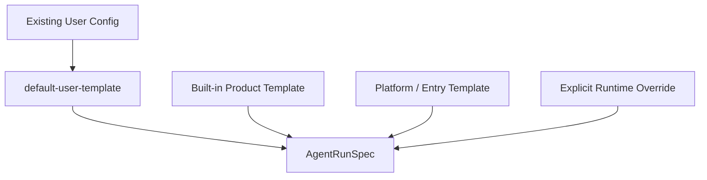

# 用户配置兼容与模板化设计

## 1. 核心判断

新的 agent runtime + controller 会影响每次对话的主要运行输入，包括上下文、tools、MCP、skills、权限、agent、model 和多 agent 编排。因此它不能变成一套绕开现有配置的新系统。

更合适的原则是：

> 现有用户配置不是被替代，而是被编译成默认模板。

`nine1bot.config.jsonc`、继承到的 opencode / Claude 配置、用户偏好和项目上下文，应该共同编译成 `default-user-template`。Web 端默认使用这个模板启动 agent。Feishu、浏览器插件、GitLab 等入口只是在这个默认模板上叠加入口上下文和场景能力。

这样用户的原有配置心智不变：

- 用户配置了默认模型，默认 Web 对话继续使用它。
- 用户选择了 agent，支持选择的入口必须显式展示当前 agent，并以用户选择为准。
- 用户配置了 instructions，应该进入 context pipeline，而不是被某个新 prompt 机制吞掉。
- 用户配置了 MCP / skills 继承策略，默认模板继续继承这些能力。
- 用户配置了权限，默认模板继续作为基础权限策略。

## 2. 当前收紧后的设计原则

这份设计现在采用更保守的兼容策略：

1. 模型默认来自 `profileSnapshot`，也允许用户在 session 中显式切换，或通过 runtime override 做单次临时选择。
2. 产品模板和平台模板不选择模型，也不偷偷覆盖模型。
3. agent 以用户在会话开始时选择的 agent 为主；允许条件具备的入口展示 agent selector。
4. agent 不允许每轮切换，因为它可能改变底部提示词和缓存形态。
5. `recommendedAgent` 只作为 UI 推荐，不作为自动覆盖规则。
6. instructions / context 应尽早重构为 context block pipeline。
7. MCP / skills 第一阶段只做增量合并，不提供排除、减少、按场景关闭能力。
8. MCP / skills 的可用集合在会话开始时确定，不允许每轮切换。
9. `SessionProfile` 在会话创建时持久化为 `profileSnapshot`，后续继续使用这份快照。
10. 配置变更默认只影响新建 session，不影响已有 session 的 `profileSnapshot`。
11. 模型是例外：允许在同一个 session 中由用户显式切换。
12. page state 只在发送请求时携带或采集，不做后台实时同步。
13. 平台模板可以新增上下文和新增资源需求，但不能静默删除用户已有能力。
14. 权限策略可以被场景收紧，但放宽必须来自用户显式选择。

## 3. 模板分层

建议把模板拆成四类来源：

### 3.1 default-user-template

由现有配置编译而来，是所有入口的基础模板。

来源包括：

- `model`
- `small_model`
- `default_agent`
- `agent`
- `instructions`
- `permission`
- `mcp`
- `skills`
- `provider`
- `customProviders`
- `isolation`
- `sandbox`
- `experimental`
- 用户偏好
- 项目上下文

这个模板的目标是尽量保留今天 Web agent 的默认行为。

### 3.2 built-in product templates

Nine1Bot 自带产品模板，例如：

- `web-default`
- `feishu-chat`
- `browser-generic`
- `gitlab-repo`
- `gitlab-mr-review`

它们只提供场景默认体验：

- 添加场景上下文。
- 添加场景资源需求。
- 添加入口约束。
- 推荐 agent 或编排模式。

它们不负责选择模型，不负责自动覆盖用户 agent。

### 3.3 platform / entry templates

具体入口或平台 adapter 生成的模板片段，例如：

- Feishu 私聊的纯文本回复约束。
- 浏览器插件提供当前 URL、页面标题和选区。
- GitLab repo 页面提供 repo path、默认分支、README 摘要。
- GitLab MR 页面提供 MR 标题、diff 摘要、review 目标。

这些模板通常依赖当前页面和当前入口，生命周期较短。

### 3.4 explicit runtime override

runtime override 必须是显式的用户或入口选择，例如：

- 用户在接入点临时选择模型。
- 用户在创建会话时选择 agent。
- 用户在创建会话时选择某个高级模式。

它不是产品模板的隐式默认值，也不是 platform adapter 可以随意写入的字段。

模型的会话级切换可以作为 `sessionChoice.model` 保存；单次入口临时模型选择才作为 `runtimeOverride.model`。

## 4. 与后续文档的关系

这份文档只说明兼容总原则。更细的内容分两篇继续展开：

- [字段详细说明](./03-agent-run-spec-fields.md)：逐项说明 model、agent、context、MCP、skills、permissions 等字段的所有权、生命周期和限制。
- [覆盖与叠加策略](./04-template-merge-overlay-strategy.md)：说明各模板来源如何合并、哪些字段允许覆盖、哪些字段只允许追加、哪些字段必须在会话开始时固定。

## 5. 迁移策略

第一阶段不要迁移配置文件格式，只做编译层：

1. 保持 `nine1bot.config.jsonc` 现有字段可用。
2. 新增 `DefaultUserTemplateCompiler`，把现有配置编译成 `default-user-template`。
3. 新建 session 时，把 `default-user-template + 会话级选择` 固化为 `profileSnapshot`。
4. Web 入口先走 `profileSnapshot`。
5. Feishu 入口改为 `profileSnapshot + feishu-chat overlay`。
6. GitLab 和浏览器插件后续再叠加平台 overlay。
7. 新增高级模板配置字段时，默认只作为 overlay，不替代旧字段。
8. 配置热更新默认只影响新 session；已有 session 继续使用创建时的 `profileSnapshot`。
9. 模型选择作为例外，可以在已有 session 内由用户显式切换，并写入 audit。

这样新架构不会破坏用户已有心智：用户仍然是在配置 Nine1Bot 的默认 agent，只是系统内部把这些配置变成了一套更具体、更可组合、更可审计的模板。

## 6. 兼容性验收标准

1. 没有任何新模板配置时，Web 默认对话行为与当前尽量一致。
2. 产品模板和平台模板不能自动覆盖用户默认模型。
3. 支持 agent 选择的入口必须展示当前 agent，且以用户会话级选择为准。
4. agent 不能每轮切换；需要切换时应新建会话或显式重开运行上下文。
5. 已有 session 在配置变更后仍继续使用创建时的 `profileSnapshot`。
6. 模型允许在同一 session 内显式切换，且必须能审计来源。
7. 用户配置的 instructions 能以 context block 形式被审计。
8. 用户配置的 MCP server 仍然能在默认 Web 对话中发现和调用。
9. MCP / skills 的第一版合并只增加，不减少，不做 per-turn 切换。
10. 用户关闭某个继承来源后，模板不能静默重新启用这个来源。
11. page state 只在请求发送时进入后端，不因页面后台变化直接写入 session history。
12. 场景模板可以收紧权限，但不能静默放宽用户 deny。
13. Debug 信息能说明本轮最终使用了哪些模板、context blocks、resources 和 permissions。
