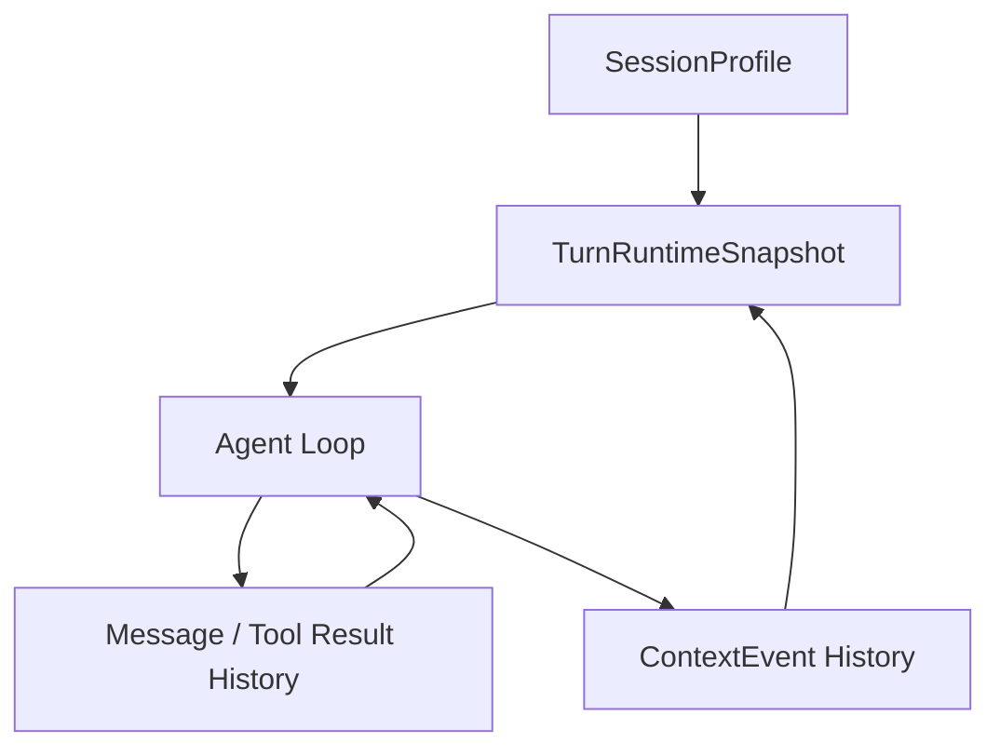

# 对话运行流程与上下文历史

## 1. 核心问题

在新的 agent runtime + controller 协议下，需要同时支持两件事：

1. 正常多轮对话：用户可以在一个 session 里连续追问，LLM 需要理解历史消息和用户环境变化。
2. agent loop：一次用户消息可能触发多步工具调用、子任务、总结和最终回复，runtime 需要保证这次 loop 内的上下文和资源稳定。

这里最重要的判断是：

> history 是语义主线；snapshot 是运行时冻结点。

也就是说，多轮语义、工具结果、页面迁移、用户追问都应该主要通过 message history 承载。`TurnRuntimeSnapshot` 不用来替代 history，它只固定本轮 agent loop 开始时那些不应该在 step 之间漂移的运行输入。

## 2. 四个核心对象

建议把一次对话运行拆成四个对象：



### 2.1 SessionProfile

`SessionProfile` 是会话开始时确定的稳定运行档案。

包含：

- agent
- model 默认值
- MCP 可用集合
- skills 可用集合
- 主要 builtin tools profile
- 基础 permissions profile
- session 级 context blocks
- 用户配置和默认模板来源

`SessionProfile` 应该在创建 session 时和会话记录一起持久化为 `profileSnapshot`。后续继续对话默认使用这份 `profileSnapshot`，不因为用户修改全局配置而自动重编译。

这些字段不应该在每轮随意变化。需要改变 agent、MCP、skills 这类字段时，优先新建 session 或显式重开运行上下文。

模型是例外：允许用户在同一个 session 中显式切换模型。模型切换只改变当前 model，不重编译 agent、MCP、skills、permissions 和 session 级 context。

### 2.2 ContextEvent History

`ContextEvent History` 是写入 history 的 synthetic context message。它记录用户环境变化，尤其是页面、平台对象和选区。

典型事件：

- 用户进入 GitLab repo 页面。
- 用户从 repo 页面切换到 MR 页面。
- 用户在同一个 MR 页面选中了一段 diff。
- 当前页面对象的关键状态发生变化。

它的目标是让 LLM 知道用户环境的历史迁移，而不是只知道当前瞬间。

page state 的发现时机绑定用户请求。客户端入口不应在页面一变化时就后台通知后端并写入 history，而应在用户发送消息时携带当前页面状态，或由后端在处理这次请求时触发采集。

### 2.3 TurnRuntimeSnapshot

`TurnRuntimeSnapshot` 是每次用户消息触发 agent loop 前编译出的运行快照。

它固定：

- 本轮使用的 templates。
- 本轮最终 model。
- 本轮 session agent。
- 本轮 system/context blocks 编译结果。
- 本轮 resource resolver 结果引用。
- 本轮 permissions profile 引用。
- 本轮是否新增了 context event。
- 本轮 audit / trace 信息。

它不固定：

- 工具调用结果。
- assistant 中间消息。
- user/assistant/tool history 的增长。
- permission ask 的具体一次性回答。

换句话说，它不是“额外历史”，而是让本轮 loop 内的非 history 输入保持稳定。

### 2.4 Message / Tool Result History

这是 LLM 真实语义推进的主线：

- user message
- assistant message
- tool call
- tool result
- synthetic context event
- summary / compaction 结果
- permission ask 的一次性结果
- resource failure 的可见事件

agent loop 每一步都应该基于 history 继续推进，而不是靠重新生成不同的 system prompt 来推进。

## 3. 正常多轮对话流程

一次普通多轮对话可以这样运行：

1. 用户创建 session。
2. controller 编译 `SessionProfile`，并持久化为 `profileSnapshot`。
3. 用户发送第一轮消息。
4. controller 先做 strict busy reservation；如果 session busy，直接拒绝且不写任何 history。
5. 用户请求携带当前入口的 page / selection / platform context，或后端在处理该请求时采集。
6. 如果有新的 context event，先写入 synthetic history message。
7. 写入 user message。
8. 编译 `TurnRuntimeSnapshot`。
9. Nine1Bot Runtime agent loop 执行。
10. assistant 和 tool result 继续进入 history。
11. 用户发送下一轮消息时，重复第 4 步开始。

这样多轮对话的连续性来自 history：

- 用户前面问过什么。
- agent 前面答过什么。
- 工具前面拿到了什么结果。
- 用户前面在哪个页面。
- 用户这次又到了哪个页面。

## 4. agent loop 内部流程

一次用户消息可能触发多步 loop。建议流程是：

1. loop 开始前完成 `TurnRuntimeSnapshot`。
2. step 1 使用这个 snapshot 里的 system/context/resources。
3. 如果模型调用工具，tool result 写入 message history。
4. step 2 继续读取更新后的 history。
5. step 2 仍然复用同一个 snapshot。
6. 直到 stop、compact、max steps 或 error。

关键约束：

- loop 内不自动重新编译 page context。
- loop 内不自动重新解析 MCP / skills 可用集合。
- loop 内不因为配置热更新而改变 agent 或 resources。
- loop 内不因为后台页面变化而自动写入新的 page context event。
- 如果模型需要最新页面状态，必须显式调用 browser / GitLab / context refresh 工具。
- 如果 MCP / skill 在 tool call 或加载时实际失败，服务端发送 resource failure 事件，客户端展示给用户。

这样可以避免同一个用户 turn 的 step 之间 runtime 输入漂移，也更利于 LLM prefix cache。

## 5. page context 为什么要进 history

页面上下文不应该只作为瞬时 system prompt。原因是多轮对话里，页面迁移本身有语义。

例子：

1. 用户在 GitLab repo 页面问：“这个项目大概是什么结构？”
2. 用户跳到一个 MR 页面继续问：“这个改动和刚才项目结构有什么关系？”

如果只保留当前页面，LLM 只能看到 MR。更好的方式是在 history 中留下：

```text
<context-event type="page-enter" pageKey="gitlab:repo:group/project">
User is viewing GitLab repository group/project.
</context-event>
```

之后切换到 MR：

```text
<context-event type="page-enter" pageKey="gitlab:mr:group/project!123">
User moved to GitLab merge request !123 in group/project.
</context-event>
```

这样 LLM 能理解用户从 repo 到 MR 的上下文变化。

## 6. page context 去重

同一个页面连续对话时，不能每轮都插入相同 page message。否则会浪费上下文，也会干扰模型判断当前重点。

建议维护 session 级 `lastInjectedPageState`：

```ts
type LastInjectedPageState = {
  pageKey: string
  digest: string
  selectionDigest?: string
  observedAt: number
}
```

这个状态不是客户端后台实时同步的 active page。它只表示“上一次成功写入 history 的页面上下文状态”，用于请求时去重。

### 6.1 pageKey

`pageKey` 是页面对象的稳定标识。

示例：

- `gitlab:repo:group/project`
- `gitlab:mr:group/project!123`
- `gitlab:file:group/project:branch:path/to/file.ts`
- `gitlab:issue:group/project#456`

### 6.2 digest

`digest` 是规范化页面状态的摘要，不应该直接 hash 整页 HTML。

可以包含：

- 页面类型
- 标题
- repo path
- MR iid
- branch
- commit sha
- diff version
- selected text hash
- visible section hash

### 6.3 插入规则

- 当前请求没有携带或触发采集 page state：不插入新 history message。
- `pageKey` 没变且 `digest` 没变：不插入新 history message，只在 audit 中记录 deduped。
- `pageKey` 没变但 `digest` 变了：插入 `page-update`。
- `pageKey` 变了：插入 `page-enter`。
- selection 变化：插入 `selection-update`，并按 `selectionDigest` 去重。

默认不插入 `page-unchanged`。如果需要调试，可以只在 audit/debug 面板里展示。

严格 busy reject 可以直接保护这条链路：busy 时新请求不会进入写入阶段，因此不会产生新的 user message，也不会产生新的 page context event。

## 7. context event 格式

建议 synthetic message 使用结构化但可读的文本：

```text
<context-event
  type="page-enter"
  source="browser-extension"
  pageKey="gitlab:mr:group/project!123"
  digest="sha256:..."
  observedAt="2026-04-25T12:00:00.000Z"
>
User moved to GitLab merge request !123 in group/project.
Title: Improve runtime resource resolver
Source branch: feat/runtime-resources
Target branch: main
</context-event>
```

如果是更新：

```text
<context-event
  type="page-update"
  source="browser-extension"
  pageKey="gitlab:mr:group/project!123"
  digest="sha256:..."
>
The user is still viewing MR !123. The selected diff hunk changed.
Selected file: packages/runtime/context.ts
</context-event>
```

这些 event 应进入 history，但需要标记为 synthetic，以便 UI 可选择折叠显示。

## 8. 与 context blocks 的关系

context blocks 和 context events 不冲突：

- context blocks 是本轮 runtime 编译输入。
- context events 是写入 history 的环境变化记录。

同一个页面信息可能同时参与两件事：

1. 作为 `page` block 编译进本轮 `TurnRuntimeSnapshot`，帮助当前 loop 立即理解页面。
2. 如果它是新页面或关键变化，作为 synthetic context event 写入 history，帮助后续多轮追问理解迁移。

如果页面没有变化：

- 可以继续用 active page block 参与当前轮。
- 不新增 context event history。

## 9. 兼容当前历史 loop

当前历史 loop 会在每个 step 读取 message history，并重新准备 system/tools。新的协议可以渐进兼容：

第一阶段：

- controller 先生成 `TurnRuntimeSnapshot`。
- 把 snapshot 编译成当前 `SessionPrompt.prompt()` 接口需要的 `system`、`tools`、`parts`。
- 在 loop 内尽量复用同一份编译结果。
- session 创建时持久化 `profileSnapshot`，旧 session 继续使用旧 snapshot。
- 模型切换作为显式 override 记录，不触发 profile 其他字段重编译。

第二阶段：

- Nine1Bot Runtime 内部把 `InstructionPrompt.system()` 和 `resolveTools()` 改成 snapshot-aware。
- step 之间不重复解析 session 级 resources。
- context event 注入成为 session prompt 的标准前置步骤。

第三阶段：

- debug UI 展示 snapshot、context block、context event、resource resolver 和 permission profile。
- 客户端展示 runtime resource failure 事件，例如 MCP 掉线、OAuth 失效、skill 加载失败。

## 10. 稳定性收益

这套流程带来几个收益：

- 多轮对话能保留页面迁移历史。
- 同一页面连续对话不会重复灌入相同上下文。
- page state 只在请求时进入后端，不会产生后台同步冲突。
- 配置热更新不会让旧 session 的 agent/resources 突然漂移。
- agent loop 内 system/context/resources 稳定。
- 用户配置、入口模板、平台上下文各有清楚边界。
- session 级权限授权能随会话持久化，单次授权又不会污染 profile。
- MCP/skills 漂移能被用户看见，不会只表现为 agent “突然不用工具”。
- debug 时可以解释本轮为什么有这些上下文和工具。
- 后续做 compaction 时，可以把 context event history 作为特殊类别处理，而不是混在普通用户文本里。
