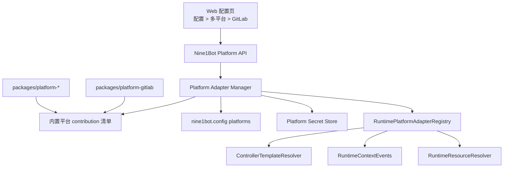

# 多平台适配层开发参考

这份文档面向要新增平台适配层的开发者。它整合了平台边界、Platform Adapter Manager 设计和当前 GitLab 样板实现，说明一个新平台应该放在哪里、导出什么、如何注册、如何展示配置、如何进入 runtime，以及如何验证不会绕过 Manager。

多平台适配的目标是让 GitLab、GitHub、Jira、飞书文档等深度适配像内置插件一样可启用、可禁用、可展示、可审计，同时保持 Agent Runtime / opencode core 的轻量和稳定。当前阶段只支持内置平台插件化，平台包仍随 Nine1Bot workspace 一起发布；外部平台安装、平台市场、本地路径加载等动态扩展能力只保留协议余量。

## 架构分层



每一层职责：

- `packages/platform-*`：平台语义、URL/page parser、browser-safe helper、runtime adapter、descriptor、status/action handler。
- `packages/platform-protocol`：平台包和 Nine1Bot 产品层共享的结构类型，不依赖 runtime core。
- `PlatformAdapterManager`：读取平台配置、管理 enable/disable、保存 secret、注册/注销 runtime adapter、暴露平台 API。
- `RuntimePlatformAdapterRegistry`：runtime core 内的通用 registry，只知道 adapter 协议，不知道 GitLab/GitHub/Jira 等具体平台。
- `ControllerTemplateResolver`：新建 session 时消费当前启用平台的 template/context/resource contribution。
- `RuntimeContextEvents`：每轮消息按当前启用平台解释 `context.page`，并写入 context event。
- `RuntimeResourceResolver`：对 profileSnapshot 中声明过的资源继续应用当前配置 live gate。

核心原则：

- 平台代码必须放在 `packages/platform-*`，不能写进 runtime core。
- 平台启用、禁用、状态、配置、secret、action 都由 Platform Manager 收口。
- Controller/template/context/resource 只消费当前启用的平台 adapter。
- 禁用平台是 hard gate：不能贡献新 session template/resource，也不能继续解释旧 session 后续 turn 的平台 page payload。
- 历史 context event 不因平台禁用而删除。

## 当前实现地图

核心文件如下：

- `packages/platform-protocol/src/index.ts`：平台 descriptor / contribution / config / action / secret / runtime adapter 的共享协议类型。
- `packages/platform-gitlab/`：GitLab 参考实现，后续平台包按这个结构复制。
- `packages/nine1bot/src/platform/manager.ts`：Nine1Bot 产品层 Platform Adapter Manager。
- `packages/nine1bot/src/platform/builtin.ts`：内置平台 contribution 清单与注册入口。
- `packages/nine1bot/src/platform/config-store.ts`：`platforms` 配置持久化 helper。
- `packages/nine1bot/src/platform/secrets.ts`：本地平台 secret store。
- `opencode/packages/opencode/src/runtime/platform/adapter.ts`：runtime core 通用平台 registry。
- `opencode/packages/opencode/src/runtime/controller/template-resolver.ts`：会话创建时根据 entry/page/template 解析 profile template。
- `opencode/packages/opencode/src/runtime/context/events.ts`：发送消息时根据 page payload 写入 context event。
- `opencode/packages/opencode/src/server/routes/nine1bot-platforms.ts`：`/nine1bot/platforms` API。
- `web/src/components/PlatformManager.vue`：Web `配置 > 多平台` 通用详情页。
- `packages/browser-extension/src/content/index.ts`：请求式页面采集入口。

必须遵守的边界：

- `opencode/packages/opencode/src/runtime` 只能依赖通用 registry 和协议，不能 import `@nine1bot/platform-*`。
- 第三方平台语义放进 `packages/platform-*`。
- browser extension 负责采集 DOM 和当前页面事实，不承担复杂平台业务解释。
- Nine1Bot 产品层负责读取配置、管理启用状态、注册 adapter、保存 secret、暴露平台 API。

## 平台包结构

新增平台使用：

```text
packages/platform-<id>/
  package.json
  tsconfig.json
  README.md
  src/
    index.ts
    browser.ts
    runtime.ts
    shared.ts
    types.ts
  test/
    <id>-platform.test.ts
```

GitLab 当前结构就是可复制样板：

```text
packages/platform-gitlab/
  src/browser.ts
  src/runtime.ts
  src/shared.ts
  src/types.ts
  test/gitlab-platform.test.ts
```

各文件职责：

- `shared.ts`：URL parser、页面类型识别、payload normalize、稳定 objectKey 生成。这里应保持纯函数，方便 browser/runtime/test 共用。
- `browser.ts`：浏览器安全导出。Web 或 extension 可以使用它构建 page payload、推导 template ids。不要依赖 Node-only API。
- `runtime.ts`：服务端 runtime adapter、descriptor、contribution。可以依赖 `@nine1bot/platform-protocol`，不要反向依赖 `packages/nine1bot`。
- `types.ts`：平台包内部类型，必要时 alias 到 `@nine1bot/platform-protocol`。
- `index.ts`：聚合导出，方便测试或内部引用。

`package.json` 至少需要声明 workspace 包名和导出入口：

```json
{
  "name": "@nine1bot/platform-example",
  "type": "module",
  "exports": {
    ".": "./src/index.ts",
    "./browser": "./src/browser.ts",
    "./runtime": "./src/runtime.ts"
  },
  "dependencies": {
    "@nine1bot/platform-protocol": "workspace:*"
  },
  "scripts": {
    "typecheck": "tsc --noEmit"
  }
}
```

## Descriptor

每个平台必须导出一个可序列化 descriptor。Web 多平台设置页、Platform API 和 Manager 都依赖它展示平台能力和配置入口。

```ts
import type { PlatformDescriptor } from '@nine1bot/platform-protocol'

export const examplePlatformDescriptor = {
  id: 'example',
  name: 'Example',
  packageName: '@nine1bot/platform-example',
  version: '0.1.0',
  defaultEnabled: true,
  capabilities: {
    pageContext: true,
    templates: ['browser-example', 'example-repo', 'example-issue'],
    resources: true,
    browserExtension: true,
    auth: 'token',
    settingsPage: true,
    statusPage: true,
  },
  config: {
    sections: [
      {
        id: 'scope',
        title: 'Access scope',
        fields: [
          {
            key: 'allowedHosts',
            type: 'string-list',
            label: 'Allowed hosts',
          },
          {
            key: 'token',
            type: 'password',
            label: 'API token',
            secret: true,
          },
        ],
      },
    ],
  },
  detailPage: {
    sections: [
      { id: 'status', type: 'status-cards', title: 'Status' },
      { id: 'settings', type: 'settings-form', title: 'Settings' },
      { id: 'actions', type: 'action-list', title: 'Actions' },
      { id: 'recent-events', type: 'event-list', title: 'Recent events' },
    ],
  },
  actions: [
    {
      id: 'connection.test',
      label: 'Test connection',
      kind: 'button',
    },
  ],
} satisfies PlatformDescriptor
```

字段约定：

- `id` 必须稳定，后续配置、secret、audit、registry 都用它作为主键。
- `capabilities.templates` 必须列出这个平台可能贡献的 template id。禁用平台时，Manager 会用这些 template id 做 runtime live gate。
- `config.sections[].fields[]` 用于 Web 通用表单渲染。
- `secret: true` 或 `type: 'password'` 字段不会以明文返回 Web；Platform Manager 会写入 secret store，并在配置里留下 `PlatformSecretRef`。
- `detailPage.sections` 第一版优先用通用 renderer；只有复杂平台需要额外交互时再使用 `type: 'custom'` 和 `componentKey`。

## Runtime Adapter

runtime adapter 是平台参与 Controller / Context Pipeline / Resource Resolver 的唯一入口。它由平台包导出，由 Nine1Bot 产品层注册。

```ts
import type {
  PlatformRuntimeAdapter,
  PlatformResourceContribution,
} from '@nine1bot/platform-protocol'

export function createExamplePlatformAdapter(): PlatformRuntimeAdapter {
  return {
    id: 'example',

    matchPage(page) {
      return page.platform === 'example'
    },

    normalizePage(page) {
      const parsed = parseExampleUrl(page.url)
      if (!parsed) return undefined
      return {
        ...page,
        platform: 'example',
        pageType: parsed.pageType,
        objectKey: parsed.objectKey,
        raw: {
          ...page.raw,
          example: parsed,
        },
      }
    },

    blocksFromPage(page, observedAt) {
      return [
        {
          id: 'platform:example',
          layer: 'platform',
          source: 'page-context.example',
          content: renderExamplePlatform(page),
          lifecycle: 'turn',
          visibility: 'developer-toggle',
          enabled: true,
          priority: 65,
          mergeKey: page.objectKey,
          observedAt,
        },
      ]
    },

    inferTemplateIds(input) {
      if (input.entry?.platform !== 'example' && input.page?.platform !== 'example') return []
      return ['browser-example', pageTemplateId(input.page)]
    },

    templateContextBlocks(input) {
      if (!input.templateIds.includes('browser-example')) return []
      return [
        {
          id: 'template:browser-example',
          layer: 'platform',
          source: 'template.browser-example',
          content: 'This session can use Example platform browser context.',
          lifecycle: 'session',
          visibility: 'developer-toggle',
          enabled: true,
          priority: 45,
        },
      ]
    },

    resourceContributions(input): PlatformResourceContribution | undefined {
      if (!input.templateIds.includes('browser-example')) return undefined
      return {
        builtinTools: {
          enabledGroups: ['example-context'],
        },
        mcp: {
          servers: [],
          lifecycle: 'session',
          mergeMode: 'additive-only',
        },
        skills: {
          skills: [],
          lifecycle: 'session',
          mergeMode: 'additive-only',
        },
      }
    },
  }
}
```

实现要点：

- `normalizePage` 要再次按 URL / raw payload 校验，不完全信任客户端字段。
- `objectKey` 必须稳定，用于 page context 去重和历史迁移理解。
- `blocksFromPage` 只生成本轮 page context block，不写存储。
- `templateContextBlocks` 生成 session 级平台说明，写入 profileSnapshot。
- `resourceContributions` 只做 add-only 贡献，不能排除用户或其他模板声明的资源。
- 平台包不要直接调用 `RuntimePlatformAdapterRegistry.register()`。

## Contribution

平台包还要导出一个 contribution，交给 Platform Manager 使用。

```ts
import type { PlatformAdapterContribution } from '@nine1bot/platform-protocol'

export const examplePlatformContribution = {
  descriptor: examplePlatformDescriptor,
  runtime: {
    createAdapter: createExamplePlatformAdapter,
  },
  async validateConfig(settings, ctx) {
    return { ok: true }
  },
  async getStatus(ctx) {
    return {
      status: ctx.enabled ? 'available' : 'disabled',
      cards: [
        {
          id: 'enabled',
          label: 'Enabled',
          value: String(ctx.enabled),
          tone: ctx.enabled ? 'success' : 'neutral',
        },
      ],
    }
  },
  async handleAction(actionId, input, ctx) {
    if (actionId === 'connection.test') {
      return {
        status: 'ok',
        message: 'Connection test completed.',
      }
    }
    return {
      status: 'failed',
      message: `Unknown action: ${actionId}`,
    }
  },
} satisfies PlatformAdapterContribution
```

`ctx` 中包含：

- `enabled`：当前平台是否启用。
- `settings`：平台配置，secret 字段只应是 `PlatformSecretRef`。
- `features`：平台能力开关。
- `env`：环境变量快照。
- `secrets`：读取/写入 secret 的安全接口。
- `audit`：平台 action/status/config 校验可以写入的审计接口。

认证差异通过 actions 表达，不要为每个平台新增独立 auth route。比如：

- token 平台：`settings.token` + `connection.test`
- OAuth 平台：`auth.open` 返回 `openUrl`，后续 `health` / `status.refresh` 刷新状态
- 外部 CLI 平台：`cli.status`、`cli.login.openGuide`、`cli.refresh`

## 注册到 Nine1Bot

新增平台后，在 Nine1Bot 产品层内置清单中注册 contribution。

当前文件：

```ts
// packages/nine1bot/src/platform/builtin.ts
import { gitlabPlatformContribution } from '@nine1bot/platform-gitlab/runtime'

export const builtinPlatformContributions = [
  gitlabPlatformContribution,
]
```

新增平台时改为：

```ts
import { examplePlatformContribution } from '@nine1bot/platform-example/runtime'

export const builtinPlatformContributions = [
  gitlabPlatformContribution,
  examplePlatformContribution,
]
```

启动流程会调用：

```ts
registerBuiltinPlatformAdapters({
  config: fullConfig.platforms,
  secrets: new FilePlatformSecretStore(...),
})
```

不要在平台包、runtime core、browser extension 中自行注册 adapter。

## Platform Manager 生命周期

Platform Manager 维护的平台状态比 Web 展示更细，用来判断问题发生在发现、配置、启用、注册还是健康检查阶段：

```text
discovered -> configured -> enabled -> registered -> healthy
                                      -> degraded
                                      -> error
```

状态含义：

- `discovered`：内置平台 contribution 已被发现。
- `configured`：已合并默认配置和用户配置。
- `enabled`：用户配置允许启用该平台。
- `registered`：平台 runtime adapter 已注册进 `RuntimePlatformAdapterRegistry`。
- `healthy`：平台当前可以正常贡献 template、context 或 resource。
- `degraded`：平台部分能力不可用，例如 API enrichment 失败，但基础 page context 仍可用。
- `error`：平台配置错误、依赖缺失或初始化失败，不能参与 runtime。

用户侧展示可以简化成 `available`、`disabled`、`missing`、`auth-required`、`degraded`、`error`。debug/audit 中应尽量保留内部阶段，方便定位平台为何没有参与本轮构建。

配置变化时的处理顺序：

1. `PATCH /nine1bot/platforms/:id` 保存平台配置。
2. Manager 调用平台 `validateConfig`。
3. 保存 `platforms` 配置，secret 字段写入 secret store。
4. 注销旧 runtime adapter。
5. 按新配置注册启用平台，或登记 disabled marker。
6. 后续新 session 和旧 session turn 都按最新 live gate 行为执行。

## 配置与 Secret

用户配置入口：

```jsonc
{
  "platforms": {
    "example": {
      "enabled": true,
      "features": {
        "pageContext": true,
        "templates": true,
        "resources": true
      },
      "settings": {
        "allowedHosts": ["example.com"],
        "token": {
          "provider": "nine1bot-local",
          "key": "platform:example:default:token"
        }
      }
    }
  }
}
```

规则：

- `enabled: false` 是 hard gate。Manager 会注销 runtime adapter，并登记 disabled marker。
- 禁用平台后，新 session 不会使用它的 template/resource contribution。
- 禁用平台后，旧 session 历史不删除。
- 旧 session 后续 turn 如果携带该平台 page payload，会走 generic fallback 或跳过，并记录 `platform-disabled-by-current-config`。
- 重新启用后，adapter 重新注册；旧 session 仍受 profileSnapshot 资源声明限制。
- secret 真值只通过 `ctx.secrets` 读取，不能进入 config、profileSnapshot、turn snapshot、runtime event、debug payload。

## Browser Extension 与 Web

browser extension 只在用户发送消息时采集当前页面，不做后台同步。平台包负责解释平台 URL。

推荐流程：

1. `packages/browser-extension/src/content/index.ts` 采集 `url`、`title`、selection、visible summary、DOM hints。
2. content script 调用 `@nine1bot/platform-<id>/browser` 的 `build<Page>ContextPayload()`。
3. sidepanel / Web 在发送消息前请求一次 page context。
4. Web 把 payload 放进 Controller message 的 `context.page`。
5. Runtime 按当前启用的平台 adapter normalize / 写 context event。

Web 侧 create session 可以带 page context，用于 session-create 模板推导：

```ts
POST /nine1bot/agent/sessions
{
  "entry": {
    "source": "browser-extension",
    "platform": "example",
    "mode": "browser-sidepanel",
    "templateIds": ["default-user-template", "browser-generic", "browser-example"]
  },
  "page": {
    "platform": "example",
    "url": "https://example.com/org/repo/issues/1",
    "title": "Issue 1"
  }
}
```

发送消息时：

```ts
POST /nine1bot/agent/sessions/:id/messages
{
  "parts": [{ "type": "text", "text": "帮我看一下这个页面" }],
  "entry": {
    "source": "browser-extension",
    "platform": "example",
    "mode": "browser-sidepanel"
  },
  "context": {
    "page": {
      "platform": "example",
      "url": "https://example.com/org/repo/issues/1",
      "title": "Issue 1"
    }
  },
  "clientCapabilities": {
    "pageContext": true,
    "selectionContext": true,
    "resourceFailures": true,
    "debug": true
  }
}
```

平台禁用时，即使前端继续发送 `platform: "example"`，后端也会按 registry disabled marker 过滤平台贡献。

## Web 多平台设置页

Web 设置页已经通过 `/nine1bot/platforms` API 消费 descriptor：

- `GET /nine1bot/platforms`：平台列表。
- `GET /nine1bot/platforms/:id`：平台详情、配置 descriptor、状态、actions。
- `PATCH /nine1bot/platforms/:id`：保存 `enabled/features/settings`。
- `POST /nine1bot/platforms/:id/health`：刷新状态。
- `POST /nine1bot/platforms/:id/actions/:actionId`：执行平台 action。

新增平台通常不需要写 Vue 专属页面。只要 descriptor 中提供 `config`、`detailPage`、`actions`，`PlatformManager.vue` 会用通用 renderer 展示。

需要复杂交互时再增加：

```ts
detailPage: {
  sections: [
    {
      id: 'custom-auth',
      title: 'Authentication',
      type: 'custom',
      componentKey: 'example-auth-panel',
    },
  ],
}
```

自定义组件仍应通过统一 Platform API 保存配置、执行 action、刷新状态。

## Runtime Live Gate

平台启用状态会影响三个入口：

1. 会话创建：`ControllerTemplateResolver` 只让启用平台贡献 template/context/resource。
2. 消息发送：`RuntimeContextEvents` 只让启用平台解释 page payload。
3. 资源执行：`RuntimeResourceResolver` 继续用当前配置作为 live gate。

当前 disabled 行为由 `RuntimePlatformAdapterRegistry` 支持：

- `markDisabled({ id, templateIds, reason })`
- `unmarkDisabled(id)`
- `activeTemplateIds(templateIds)`
- `disabledAudits({ page, templateIds })`

Platform Manager 在平台禁用时调用 `markDisabled`，启用时调用 `unmarkDisabled` 并注册 adapter。

禁用平台的 audit 标准 reason：

```text
platform-disabled-by-current-config
```

这个 reason 会进入：

- template resolver audit 的 `skippedPlatforms`
- page context event 的 `audit`
- fallback context block 文本
- debug API 中的 context events

## 测试清单

新增平台至少补这些测试：

### 平台包测试

```text
packages/platform-<id>/test/<id>-platform.test.ts
```

覆盖：

- URL parser：repo/file/issue/MR/doc 等主要页面。
- page payload builder：稳定 `platform/pageType/objectKey/raw`。
- template id 推导。
- template context block。
- resource contribution。
- runtime page context block。

命令：

```bash
bun run --cwd packages/platform-<id> typecheck
bun test packages/platform-<id>
```

### Manager 测试

文件：

```text
packages/nine1bot/src/platform/manager.test.ts
```

覆盖：

- 默认启用平台会注册 adapter。
- `enabled: false` 会跳过注册并登记 disabled marker。
- 重新启用会恢复注册。
- settings/features/secrets 会传给 contribution context。
- status/action 失败不会影响其他平台。

### Runtime 边界测试

文件：

```text
opencode/packages/opencode/test/platform/runtime-core-boundary.test.ts
```

这个测试会扫描 runtime core，确保没有直接 import 具体平台包。新增平台时，如果这个测试失败，说明平台语义写错了层。

### Template / Context 测试

文件：

```text
opencode/packages/opencode/test/controller/template-resolver.test.ts
opencode/packages/opencode/test/session/platform-page-context.test.ts
```

覆盖：

- 启用平台能贡献 template/context/resource。
- 禁用平台不会贡献 template/resource。
- 禁用平台 page payload 会 fallback 或跳过，并写 `platform-disabled-by-current-config`。
- 旧 page context history 不删除。
- 同一 page payload 连续发送去重仍然有效。

### Web / Extension 测试

文件：

```text
web/test/config-api.test.ts
web/test/controller-message-page-context.test.ts
packages/browser-extension/test/<id>-page-context.test.ts
```

覆盖：

- 平台配置页仍走 `/nine1bot/platforms`。
- 普通 Web 对话不携带 page context。
- browser extension 环境发送消息时携带 `context.page`。
- browser parser 不依赖 Chrome API 也能测试。

## 回归命令

平台适配改动建议至少跑：

```bash
bun run --cwd packages/platform-protocol typecheck
bun run --cwd packages/platform-<id> typecheck
bun test packages/platform-<id>
bun test packages/nine1bot/src/platform packages/nine1bot/src/config packages/nine1bot/src/engine
bun test opencode/packages/opencode/test/controller opencode/packages/opencode/test/resource opencode/packages/opencode/test/platform opencode/packages/opencode/test/session/platform-page-context.test.ts
bun test web/test/config-api.test.ts web/test/controller-message-page-context.test.ts web/test/runtime-events.test.ts
bun run --cwd packages/browser-extension typecheck
bun run --cwd packages/browser-extension build
bun run build:web
git diff --check
```

如果改动涉及 Controller API、权限、资源解析或 session profile，还要补跑相关 `opencode/packages/opencode/test/server` 与 `opencode/packages/opencode/test/session` 回归。

## 开发 Checklist

新增平台 PR 合入前确认：

- 平台代码位于 `packages/platform-<id>`。
- 平台包导出了 `./browser` 和 `./runtime`。
- descriptor 中 `id`、`capabilities.templates`、`config`、`detailPage`、`actions` 完整。
- contribution 不反向依赖 Nine1Bot 产品层。
- Nine1Bot 只在 `builtinPlatformContributions` 注册 contribution。
- runtime core 没有 import 具体平台包。
- Browser extension 只请求式采集页面，不后台轮询。
- Web 普通对话不受平台适配影响。
- 禁用平台后不会贡献 template/resource/context。
- 禁用后重新启用能恢复 adapter 注册。
- Secret 字段不进入 config 明文、profileSnapshot、turn snapshot、runtime event、debug payload。
- 测试覆盖 parser、template、context、resource、manager、web/extension 请求路径。
