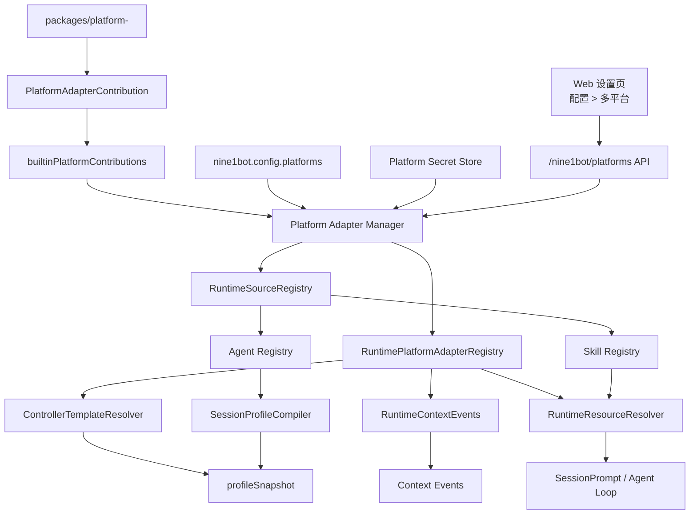

# 多平台适配层开发技术文档

这份文档面向开发新的平台适配层的同学，说明一个平台适配包应该放在哪里、导出什么、如何注册到 Nine1Bot、如何参与 Controller / Runtime，以及如何验证它没有破坏核心 Runtime 的轻量化。

当前平台适配只支持 **内置平台插件化**：平台包跟随 Nine1Bot workspace 一起发布，由 Nine1Bot 产品层的 Platform Adapter Manager 统一发现、配置、启用、禁用和注册。外部平台市场、本地动态安装、第三方包热加载暂不在当前范围内。

## 1. 核心原则

- 平台语义必须放在 `packages/platform-*`，不要写进 `opencode/packages/opencode/src/runtime`。
- Runtime core 只保留通用协议、registry、context pipeline、resource resolver、agent / skill source 扫描逻辑。
- Nine1Bot 产品层负责平台启用状态、配置、secret、status、action、Web 设置页和 runtime 注册。
- Browser extension 只在用户发送消息时采集页面事实，不做后台监听，也不承担复杂平台业务解释。
- 平台贡献 context / resources / agents / skills 必须经过 Platform Adapter Manager 和 runtime registry，不能绕过 Manager。
- 平台禁用是 hard gate：新 session 不使用该平台 template/resource/source，旧 session 后续 turn 也不能继续获得该平台能力。
- 平台资源默认应使用 `declared-only` 或 `recommendable`，避免污染普通 Web 对话和 default-user-template。

## 2. 架构总览



关键点：

- `PlatformAdapterContribution` 是平台包对外提供能力的统一入口。
- `RuntimePlatformAdapterRegistry` 只接收通用 adapter，不 import 具体平台包。
- `RuntimeSourceRegistry` 只保存 agent / skill source 元数据，文件扫描由 Agent / Skill registry 完成。
- `profileSnapshot` 是 session 创建时冻结的平台能力声明；后续 turn 只在该声明内做 live gate。

## 3. 当前实现地图

核心文件：

- `packages/platform-protocol/src/index.ts`：平台 descriptor、contribution、config、secret、action、runtime adapter、runtime sources 的共享类型。
- `packages/platform-gitlab/`：当前 GitLab 样板平台包。
- `packages/nine1bot/src/platform/manager.ts`：Platform Adapter Manager。
- `packages/nine1bot/src/platform/builtin.ts`：内置平台 contribution 清单。
- `packages/nine1bot/src/platform/config-store.ts`：只更新 `nine1bot.config` 中 `platforms` 字段的持久化 helper。
- `packages/nine1bot/src/platform/secrets.ts`：本地平台 secret store。
- `opencode/packages/opencode/src/runtime/platform/adapter.ts`：Runtime 平台 adapter registry。
- `opencode/packages/opencode/src/runtime/source/registry.ts`：Runtime agent / skill source registry。
- `opencode/packages/opencode/src/agent/agent.ts`：内置 / 用户 / 平台 agent 扫描和可见性控制。
- `opencode/packages/opencode/src/skill/skill.ts`：默认技能和平台 skill source 扫描。
- `opencode/packages/opencode/src/server/routes/nine1bot-platforms.ts`：平台管理 API。
- `web/src/components/PlatformManager.vue`：Web 多平台设置页通用 renderer。

边界测试：

- `opencode/packages/opencode/test/platform/runtime-core-boundary.test.ts`

这个测试会检查 runtime core 是否直接 import 具体平台包。新增平台时如果它失败，通常说明平台语义写错了层。

## 4. 新增平台包结构

新增平台建议使用下面的目录结构：

```text
packages/platform-<id>/
  package.json
  tsconfig.json
  README.md
  src/
    index.ts
    browser.ts
    runtime.ts
    shared.ts
    types.ts
  agents/
    <optional-platform-agent>.agent.md
  skills/
    <optional-platform-skill>/
      SKILL.md
  test/
    <id>-platform.test.ts
```

文件职责：

- `shared.ts`：URL 解析、页面类型识别、payload normalize、稳定 `objectKey` 生成。保持纯函数，便于 browser / runtime / test 复用。
- `browser.ts`：浏览器安全入口，供 browser extension 或 Web 使用。不要依赖 Node-only API。
- `runtime.ts`：平台 descriptor、runtime adapter、contribution、status/action handler。
- `types.ts`：平台内部类型，可以复用或 alias `@nine1bot/platform-protocol` 类型。
- `agents/`：平台自带 agent source，可选。文件格式是 `*.agent.md`。
- `skills/`：平台自带 skills source，可选。每个 skill 目录包含 `SKILL.md`。
- `index.ts`：聚合导出，方便测试和内部引用。

`package.json` 示例：

```json
{
  "name": "@nine1bot/platform-example",
  "type": "module",
  "exports": {
    ".": "./src/index.ts",
    "./browser": "./src/browser.ts",
    "./runtime": "./src/runtime.ts"
  },
  "dependencies": {
    "@nine1bot/platform-protocol": "workspace:*"
  },
  "scripts": {
    "typecheck": "tsc --noEmit"
  }
}
```

## 5. Descriptor

每个平台必须导出一个可序列化的 `PlatformDescriptor`。Web 设置页、Platform API 和 Manager 都依赖它展示平台能力、配置字段和 action。

```ts
import type { PlatformDescriptor } from '@nine1bot/platform-protocol'

export const examplePlatformDescriptor = {
  id: 'example',
  name: 'Example',
  packageName: '@nine1bot/platform-example',
  version: '0.1.0',
  description: 'Example platform integration.',
  defaultEnabled: true,
  capabilities: {
    pageContext: true,
    templates: ['browser-example', 'example-repo', 'example-issue'],
    resources: true,
    browserExtension: true,
    auth: 'token',
    settingsPage: true,
    statusPage: true,
  },
  config: {
    sections: [
      {
        id: 'scope',
        title: 'Access scope',
        fields: [
          {
            key: 'allowedHosts',
            type: 'string-list',
            label: 'Allowed hosts',
          },
          {
            key: 'token',
            type: 'password',
            label: 'API token',
            secret: true,
          },
        ],
      },
    ],
  },
  detailPage: {
    sections: [
      { id: 'status', title: 'Status', type: 'status-cards' },
      { id: 'capabilities', title: 'Capabilities', type: 'capability-list' },
      { id: 'settings', title: 'Settings', type: 'settings-form' },
      { id: 'actions', title: 'Actions', type: 'action-list' },
      { id: 'recent-events', title: 'Recent events', type: 'event-list' },
    ],
  },
  actions: [
    {
      id: 'connection.test',
      label: 'Test connection',
      kind: 'button',
    },
  ],
} satisfies PlatformDescriptor
```

约定：

- `id` 必须稳定。配置、secret、audit、registry 都用它作为主键。
- `capabilities.templates` 要列出平台可能贡献的 template id。平台禁用时，Manager 会基于这些 template id 做 live gate。
- `config.sections[].fields[]` 由 Web 通用表单渲染。
- `type: 'password'` 或 `secret: true` 的字段不会明文返回 Web。
- `detailPage.sections` 优先使用通用 section。复杂平台后续可以使用 `type: 'custom'` 和 `componentKey`。
- 不要在 descriptor 里放函数、token、路径探测结果等运行时对象。

## 6. Runtime Adapter

`PlatformRuntimeAdapter` 是平台参与 Controller / Context Pipeline / Resource Resolver 的唯一 Runtime 入口。

```ts
import type { PlatformRuntimeAdapter } from '@nine1bot/platform-protocol'

export function createExamplePlatformAdapter(): PlatformRuntimeAdapter {
  return {
    id: 'example',

    matchPage(page) {
      return page.platform === 'example' || isExampleUrl(page.url)
    },

    normalizePage(page) {
      const parsed = parseExampleUrl(page.url)
      if (!parsed) return undefined
      return {
        ...page,
        platform: 'example',
        pageType: parsed.pageType,
        objectKey: parsed.objectKey,
        raw: {
          ...page.raw,
          example: parsed,
        },
      }
    },

    blocksFromPage(page, observedAt) {
      const normalized = this.normalizePage?.(page)
      if (!normalized) return undefined
      return [
        {
          id: 'platform:example',
          layer: 'platform',
          source: 'page-context.example',
          content: renderExamplePlatformContext(normalized),
          lifecycle: 'turn',
          visibility: 'developer-toggle',
          enabled: true,
          priority: 65,
          mergeKey: normalized.objectKey,
          observedAt,
        },
      ]
    },

    inferTemplateIds(input) {
      if (input.entry?.platform !== 'example' && input.page?.platform !== 'example') return []
      return ['browser-example', templateIdForPage(input.page)]
    },

    templateContextBlocks(input) {
      if (!input.templateIds.includes('browser-example')) return []
      return [
        {
          id: 'template:browser-example',
          layer: 'platform',
          source: 'template.browser-example',
          content: 'This session can use Example platform browser context.',
          lifecycle: 'session',
          visibility: 'developer-toggle',
          enabled: true,
          priority: 45,
        },
      ]
    },

    resourceContributions(input) {
      if (!input.templateIds.includes('browser-example')) return undefined
      return {
        builtinTools: {
          enabledGroups: ['example-context'],
        },
        mcp: {
          servers: [],
          lifecycle: 'session',
          mergeMode: 'additive-only',
        },
        skills: {
          skills: [],
          lifecycle: 'session',
          mergeMode: 'additive-only',
        },
      }
    },

    recommendedAgent(input) {
      if (input.templateIds.includes('example-review')) return 'platform.example.coordinator'
      return undefined
    },
  }
}
```

实现规则：

- `normalizePage` 必须重新按 URL / raw payload 校验，不完全信任客户端字段。
- `objectKey` 必须稳定，用于 context event 去重。
- `blocksFromPage` 只返回本轮 page blocks，不直接写 storage。
- `templateContextBlocks` 返回 session 级 context blocks，会进入 `profileSnapshot.context`。
- `resourceContributions` 只能 add-only，不能排除或减少其它资源。
- `recommendedAgent` 只是 UI 推荐或创建 session 的建议值，不能静默覆盖用户选择。
- 平台包不要直接调用 `RuntimePlatformAdapterRegistry.register()`。

## 7. Contribution

平台包通过 `PlatformAdapterContribution` 把 descriptor、runtime adapter、runtime sources、status、config validation 和 actions 交给 Platform Manager。

```ts
import type { PlatformAdapterContribution } from '@nine1bot/platform-protocol'

export const examplePlatformContribution = {
  descriptor: examplePlatformDescriptor,
  runtime: {
    createAdapter: createExamplePlatformAdapter,
    sources: {
      agents: [
        {
          id: 'example-agents',
          directory: new URL('../agents', import.meta.url).pathname,
          namespace: 'platform.example',
          visibility: 'recommendable',
          lifecycle: 'platform-enabled',
        },
      ],
      skills: [
        {
          id: 'example-skills',
          directory: new URL('../skills', import.meta.url).pathname,
          namespace: 'platform.example',
          visibility: 'declared-only',
          lifecycle: 'platform-enabled',
        },
      ],
    },
  },
  async validateConfig(settings, ctx) {
    return { ok: true }
  },
  async getStatus(ctx) {
    return {
      status: ctx.enabled ? 'available' : 'disabled',
      cards: [
        {
          id: 'enabled',
          label: 'Enabled',
          value: String(ctx.enabled),
          tone: ctx.enabled ? 'success' : 'neutral',
        },
      ],
    }
  },
  async handleAction(actionId, input, ctx) {
    if (actionId === 'connection.test') {
      return { status: 'ok', message: 'Connection test completed.' }
    }
    return { status: 'failed', message: `Unknown action: ${actionId}` }
  },
} satisfies PlatformAdapterContribution
```

`PlatformAdapterContext` 提供：

- `platformId`
- `enabled`
- `settings`
- `features`
- `env`
- `secrets`
- `audit`

注意：

- `settings` 中的 secret 字段应是 `PlatformSecretRef`，不要假设有明文。
- `handleAction` 返回 `openUrl` 时只允许 `http:` / `https:`。
- `danger: true` 的 action 需要请求体带 `confirm: true`。
- status/action/validation 失败要返回结构化结果或抛错，Manager 会转成 `error/degraded` 状态。

## 8. 注册到 Nine1Bot

新增平台后，只在 Nine1Bot 产品层内置清单中注册 contribution。

```ts
// packages/nine1bot/src/platform/builtin.ts
import { gitlabPlatformContribution } from '@nine1bot/platform-gitlab/runtime'
import { examplePlatformContribution } from '@nine1bot/platform-example/runtime'

export const builtinPlatformContributions = [
  gitlabPlatformContribution,
  examplePlatformContribution,
]
```

不要在下面这些位置手动注册：

- `packages/platform-<id>`
- `packages/browser-extension`
- `web`
- `opencode/packages/opencode/src/runtime`

启动时 Nine1Bot 会根据 `fullConfig.platforms` 调用 Manager 注册启用的平台。禁用的平台会被登记到 `RuntimePlatformAdapterRegistry` 的 disabled marker，用于后续 template/page live gate。

## 9. 配置与 Secret

用户配置位于 `nine1bot.config` 的 `platforms` 字段：

```jsonc
{
  "platforms": {
    "example": {
      "enabled": true,
      "features": {
        "pageContext": true,
        "templates": true,
        "resources": true
      },
      "settings": {
        "allowedHosts": ["example.com"],
        "token": {
          "provider": "nine1bot-local",
          "key": "platform:example:default:token"
        }
      }
    }
  }
}
```

规则：

- `platforms` 是 Nine1Bot-only 配置，不会进入生成给 Runtime 的 opencode config。
- secret 真值写入本地 `platform-secrets.json` 或通过 `env/external` 引用，不进入 `nine1bot.config`。
- Platform API 响应中 secret 字段只返回 `{ redacted: true, hasValue, provider }`。
- `PATCH /nine1bot/platforms/:id` 中 secret 字段传空字符串表示保留旧值，传 `null` 表示删除。
- `enabled: false` 会立即注销 adapter 和 runtime sources。

认证差异应通过平台 action 和 settings 表达，不要新增固定的 `/auth/start` / `/auth/complete` 路由。例如：

- token：`settings.token` + `connection.test`
- OAuth：`auth.open` action 返回 `openUrl`
- 外部 CLI：`cli.status`、`cli.login.openGuide`、`cli.refresh`

## 10. Browser / Web 页面上下文

Browser extension 的职责是请求式采集页面事实：

1. Web iframe 在发送消息前请求 active page context。
2. sidepanel 查询当前 active tab。
3. content script 采集 `url`、`title`、selection、visible summary、DOM hints。
4. 平台包的 `./browser` helper 生成浏览器安全 payload。
5. Web 把 payload 放入 Controller message 的 `context.page`。
6. Runtime 通过当前启用的平台 adapter normalize / 写 context event。

创建 session 时可以携带 page，用于推导 session template：

```json
{
  "entry": {
    "source": "browser-extension",
    "platform": "example",
    "mode": "browser-sidepanel",
    "templateIds": ["web-chat", "browser-generic"]
  },
  "page": {
    "platform": "example",
    "url": "https://example.com/org/repo/issues/1",
    "title": "Issue 1"
  }
}
```

发送消息时携带 page：

```json
{
  "parts": [{ "type": "text", "text": "帮我看一下这个页面" }],
  "entry": {
    "source": "browser-extension",
    "platform": "example",
    "mode": "browser-sidepanel"
  },
  "context": {
    "page": {
      "platform": "example",
      "url": "https://example.com/org/repo/issues/1",
      "title": "Issue 1"
    }
  },
  "clientCapabilities": {
    "pageContext": true,
    "selectionContext": true,
    "resourceFailures": true,
    "debug": true
  }
}
```

如果平台被禁用，后端会按 disabled marker 跳过平台 adapter，并在 audit/debug 中写 `platform-disabled-by-current-config`。

## 11. 平台 Resources

平台资源贡献发生在 session 创建阶段：

```text
ControllerTemplateResolver
  -> RuntimePlatformAdapterRegistry.resourceContributions()
  -> profileSnapshot.resources
  -> RuntimeResourceResolver live gate
```

语义：

- 平台 template 和 `sessionChoice.resources` 只能 add-only。
- `profileSnapshot.resources` 冻结的是资源身份，不冻结 MCP 连接配置或 skill 文件内容。
- 当前用户配置仍是 live gate。
- 旧 session 只允许继续使用 profile 中声明过的资源。
- 配置新增的 MCP / skill 只影响新 session，不自动进入旧 session。
- 配置禁用的 MCP / skill 会立即影响旧 session 后续 turn。

平台 adapter 贡献平台 skills 时，应只声明平台 skill 名称：

```ts
resourceContributions(input) {
  if (!input.templateIds.includes('example-workflow')) return undefined
  return {
    builtinTools: {
      enabledGroups: ['example-context'],
    },
    mcp: {
      servers: ['example-readonly'],
      lifecycle: 'session',
      mergeMode: 'additive-only',
    },
    skills: {
      skills: ['platform.example.workflow-guidance'],
      lifecycle: 'session',
      mergeMode: 'additive-only',
    },
  }
}
```

## 12. 平台 Skills

平台可以自带 skills，但默认不进入普通会话。

目录示例：

```text
packages/platform-example/skills/
  workflow-guidance/
    SKILL.md
  output-formatting/
    SKILL.md
```

注册 source：

```ts
runtime: {
  sources: {
    skills: [
      {
        id: 'example-skills',
        directory: new URL('../skills', import.meta.url).pathname,
        namespace: 'platform.example',
        visibility: 'declared-only',
        lifecycle: 'platform-enabled',
      },
    ],
  },
}
```

当前实现语义：

- `Skill.all()` 默认只返回默认可见技能。
- `Skill.all({ includeDeclaredOnly: true })` 会返回 declared-only 平台技能。
- `compileProfileResources()` 只继承默认可见 skills。
- `RuntimeResourceResolver.resolveSkills()` 使用完整 registry，因此显式声明的平台 skill 可以解析。
- `SkillTool` 只使用 resolver 传入的 `availableSkills`，不会自行暴露所有平台技能。
- 平台禁用或 source 注销后，旧 profile 中声明的平台 skill 会变为 unavailable，并走 `runtime.resource.failed` / audit 路径。

推荐命名：

```text
platform.<platform-id>.<skill-name>
```

这样可以避免覆盖用户或内置技能。

## 13. 平台 Agents

平台可以自带 agents，用于平台特定工作流。agent 会影响系统提示词和权限边界，因此只能在 session 创建时选择并冻结。

目录示例：

```text
packages/platform-example/agents/
  coordinator.agent.md
  reviewer.agent.md
```

agent 文件示例：

```md
---
name: platform.example.coordinator
description: Coordinates an Example platform workflow.
mode: primary
hidden: true
permission:
  read: allow
  skill: allow
---

You are the Example platform coordinator.
```

注册 source：

```ts
runtime: {
  sources: {
    agents: [
      {
        id: 'example-agents',
        directory: new URL('../agents', import.meta.url).pathname,
        namespace: 'platform.example',
        visibility: 'recommendable',
        lifecycle: 'platform-enabled',
      },
    ],
  },
}
```

可见性语义：

- `declared-only`：普通 agent 列表不展示，只能由 sessionChoice 或模板显式引用。
- `recommendable`：普通 agent 列表不展示，但平台 adapter 可以返回 `recommendedAgent`，供 UI 推荐。
- `user-selectable`：平台启用时可以在支持 agent 选择的 UI 中展示。

当前实现规则：

- `Agent.defaultAgent()` 不会返回平台 agent。
- `sessionChoice.agent` 可以选择 `user-selectable`、`recommendable`、`declared-only` 平台 agent。
- `ControllerTemplateResolver` 会校验 `recommendedAgent` 是否存在；不存在则 fallback，并写 audit。
- `recommendedAgent` 只作为推荐，不静默覆盖用户选择。
- 每轮 `body.agent` override 继续忽略，只 audit，不改变 `profileSnapshot.agent`。
- 平台禁用后，旧 session 如果 profile 中冻结的是该平台 agent，本轮会 fail closed，并发出 `runtime.agent.unavailable`。

## 14. Web 多平台设置页

Web 通过 `/nine1bot/platforms` API 消费 descriptor：

- `GET /nine1bot/platforms`
- `GET /nine1bot/platforms/:id`
- `PATCH /nine1bot/platforms/:id`
- `POST /nine1bot/platforms/:id/health`
- `POST /nine1bot/platforms/:id/actions/:actionId`

第一版平台通常不需要写专属 Vue 页面。`PlatformManager.vue` 会根据 descriptor 渲染：

- 平台列表
- 启用状态
- runtime status cards
- capability chips
- settings form
- action list
- recent events
- runtime sources 摘要

如果平台需要复杂 UI，可以在 descriptor 中声明 custom section：

```ts
detailPage: {
  sections: [
    {
      id: 'custom-auth',
      title: 'Authentication',
      type: 'custom',
      componentKey: 'example-auth-panel',
    },
  ],
}
```

自定义组件仍应通过统一 Platform API 保存配置、执行 action、刷新状态。

## 15. Live Gate 与禁用语义

平台禁用后：

- Manager 注销 runtime adapter。
- Manager 注销 runtime sources。
- Manager 在 `RuntimePlatformAdapterRegistry` 里登记 disabled marker。
- 新 session 不会使用该平台 template/context/resource contribution。
- 旧 session 历史 context event 不删除。
- 旧 session 后续 turn 携带该平台 page payload 时，平台 adapter 不参与解释。
- 旧 session 后续 turn 使用该平台 skill 时，resolver 返回 unavailable。
- 旧 session 后续 turn 使用该平台 agent 时，compiler fail closed 并发 `runtime.agent.unavailable`。

标准 audit reason：

```text
platform-disabled-by-current-config
```

这个 reason 应出现在：

- template resolver audit
- page context event audit
- resource resolver audit
- runtime debug
- 相关 runtime event

## 16. 新增平台开发步骤

建议按这个顺序做：

1. 创建 `packages/platform-<id>`。
2. 实现 `shared.ts`：URL parser、pageType、objectKey、normalize。
3. 实现 `browser.ts`：浏览器安全 payload builder。
4. 实现 `runtime.ts`：descriptor、adapter、contribution。
5. 按需增加 `agents/` 和 `skills/`，并在 contribution 中声明 runtime sources。
6. 在 `packages/nine1bot/src/platform/builtin.ts` 注册 contribution。
7. 补平台包 parser / adapter 测试。
8. 补 Manager enable / disable / status / source 测试。
9. 补 Controller template / page context / resource live gate 测试。
10. 补 Web API / browser extension 请求路径测试。
11. 跑完整回归。

## 17. 测试清单

### 平台包测试

建议文件：

```text
packages/platform-<id>/test/<id>-platform.test.ts
```

覆盖：

- URL parser 主要页面类型。
- page payload builder。
- template id 推导。
- template context blocks。
- resource contribution。
- runtime page context blocks。
- runtime source descriptor 路径与可见性。

### Platform Manager 测试

建议文件：

```text
packages/nine1bot/src/platform/manager.test.ts
```

覆盖：

- 默认启用平台会注册 adapter。
- `enabled: false` 会跳过注册并登记 disabled marker。
- 重新启用会恢复注册。
- settings / features / secrets 会传给 contribution context。
- status / action 失败不会影响其它平台。
- runtime sources 随平台 enabled / disabled 注册和注销。

### Runtime 测试

建议文件：

```text
opencode/packages/opencode/test/platform/runtime-core-boundary.test.ts
opencode/packages/opencode/test/controller/template-resolver.test.ts
opencode/packages/opencode/test/skill/platform-skill-source.test.ts
opencode/packages/opencode/test/agent/platform-agent-source.test.ts
```

覆盖：

- runtime core 不 import 具体平台包。
- 启用平台能贡献 template/context/resource。
- 禁用平台不会贡献 template/resource。
- 平台 skill 默认不进入普通列表，显式声明后可解析。
- 平台 agent 默认不进入 defaultAgent，显式选择后可冻结。
- 平台禁用后旧 session 的平台 agent fail closed。

### Web / Extension 测试

建议文件：

```text
web/test/config-api.test.ts
web/test/controller-message-page-context.test.ts
web/test/runtime-events.test.ts
packages/browser-extension/test/<id>-page-context.test.ts
```

覆盖：

- 平台设置走 `/nine1bot/platforms` API。
- 普通 Web 对话不携带 page context。
- browser extension 环境发送消息时携带 `context.page`。
- disabled 平台不会影响普通 Web 对话。
- runtime event 能表达 resource / agent unavailable。

## 18. 推荐回归命令

平台适配改动建议至少跑：

```bash
bun run --cwd packages/platform-protocol typecheck
bun run --cwd packages/platform-<id> typecheck
bun test packages/platform-<id>
bun test packages/nine1bot/src/platform packages/nine1bot/src/config packages/nine1bot/src/engine
bun run --cwd packages/nine1bot typecheck
bun run --cwd opencode/packages/opencode typecheck
bun test opencode/packages/opencode/test/controller opencode/packages/opencode/test/platform opencode/packages/opencode/test/skill opencode/packages/opencode/test/agent
bun test web/test/config-api.test.ts web/test/controller-message-page-context.test.ts web/test/runtime-events.test.ts
bun run --cwd packages/browser-extension typecheck
bun run --cwd packages/browser-extension build
bun run build:web
git diff --check
```

如果平台改动涉及 session profile、权限、MCP、artifact、interaction 或 legacy API，还要补跑对应的 session / server 测试。

## 19. PR Checklist

新增平台 PR 合入前确认：

- 平台代码位于 `packages/platform-<id>`。
- 平台包导出 `./browser` 和 `./runtime`。
- descriptor 中 `id`、`capabilities.templates`、`config`、`detailPage`、`actions` 清晰。
- contribution 不反向依赖 Nine1Bot 产品层。
- Nine1Bot 只在 `builtinPlatformContributions` 注册 contribution。
- runtime core 没有 import 具体平台包。
- Browser extension 只请求式采集页面，不后台轮询。
- Web 普通对话不受平台适配影响。
- 禁用平台后不会贡献 template/resource/context/source。
- 禁用后重新启用能恢复 adapter 和 sources 注册。
- 平台 skills 默认不进入普通会话。
- 平台 agents 不进入 `defaultAgent()`。
- Secret 字段不进入 config 明文、profileSnapshot、turn snapshot、runtime event、debug payload。
- 测试覆盖 parser、template、context、resource、manager、web/extension 请求路径。

## 20. 常见错误

- 把 GitLab / Jira / GitHub 等平台逻辑写进 runtime core。
- 在平台包里直接注册 runtime adapter。
- 把平台 skill 放进全局 built-in skills，导致普通会话默认继承。
- 用平台 template 静默切换用户模型。
- 每轮消息用 `body.agent` 切换平台 agent。
- 平台禁用后只隐藏 Web 设置页，没有注销 adapter/source。
- 将 token 明文写进 config、audit、debug 或 runtime event。
- browser extension 做后台页面同步，造成 context 污染和 busy 语义不一致。
